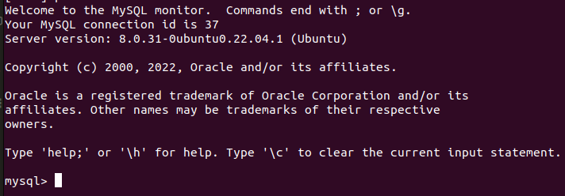

# Install MYSQL
```bash
sudo apt-get install mysql-server
```


To test that mysql is well installed :

```bash
sudo mysql
```



## Configure MYSQL

### Create the database
```bash
CREATE DATABASE stib;
```


### Create users
```bash
create user 'stib'@'host' identified  by 'Stib1234!';
```

```bash
create user 'stib'@'localhost' identified  by 'Stib1234!';
```

### Give access
```bash
grant all privileges on stib.* to 'stib'@'host';
```
```bash
grant all privileges on stib.* to 'stib'@'localhost';
```

## Create table
Connect yourself to the database
```bash
use stib;
```

```bash
CREATE TABLE IF NOT EXISTS trips (
route_id INT NOT NULL,
service_id INT NOT NULL,
trip_id BIGINT PRIMARY KEY,
trip_headsign VARCHAR(32) NOT NULL,
direction_id INT NOT NULL,
block_id INT NOT NULL,
shape_id VARCHAR(32) NOT NULL);

CREATE TABLE IF NOT EXISTS routes (
routes_id INT PRIMARY KEY,
routes_short_name VARCHAR(8) NOT NULL,
routes_long_name VARCHAR(128) NOT NULL,
route_type INT NOT NULL,
route_color VARCHAR(8) NOT NULL,
route_text_color VARCHAR(8) NOT NULL);

CREATE TABLE IF NOT EXISTS calendar (
service_id INT PRIMARY KEY,
monday INT NOT NULL,
tuesday INT NOT NULL,
wednesday INT NOT NULL,
thursday INT NOT NULL,
friday INT NOT NULL,
saturday INT NOT NULL,
sunday INT NOT NULL,
start_date INT NOT NULL,
end_date INT NOT NULL);

CREATE TABLE IF NOT EXISTS stops (
stop_id VARCHAR(8) PRIMARY KEY,
stop_name VARCHAR(64) NOT NULL,
shape_pt_lat FLOAT(32) NOT NULL,
shape_pt_lon FLOAT(32) NOT NULL,
location_type INT NOT NULL,
parent_station FLOAT(8));

CREATE TABLE IF NOT EXISTS stop_times (
trip_id BIGINT NOT NULL,
arrival_time VARCHAR(32) NOT NULL,
departure_time VARCHAR(32) NOT NULL,
stop_id VARCHAR(8) NOT NULL,
stop_sequence INT NOT NULL,
pickup_type INT NOT NULL,
drop_off_type INT NOT NULL,
PRIMARY KEY (trip_id, stop_id));
```

### VERIFY THAT IT IS GOOD


## Load files

This line is probable to be shown when loading the csv
```bash
ERROR 1290 (HY000): The MySQL server is running with the --secure-file-priv option so it cannot execute this statement
```
To resolve this problem, run the following command and move your csv file to that specific folder
```bash
SHOW VARIABLES LIKE "secure_file_priv";
```
-> Sur mon ubuntu, l'output est dans : */var/lib/mysql-files*


**Attention :** 
* pour  **routes.csv**, il faut retirer les deux colonnes vides pour pas que ca crash
* pour **stops.csv**, il faut retirer les colonnes complètement vide puis lancer ce script :
  
```python
data = pd.read_csv('../../data/gtfs3Sept/stops.csv', sep=",")
data = data.replace(np.nan,0)
data.to_csv("../../data/gtfs3Sept/stops.csv", index = False)
```


```bash
LOAD DATA INFILE '/var/lib/mysql-files/trips.csv' 
INTO TABLE trips 
FIELDS TERMINATED BY ',' 
ENCLOSED BY '"'
LINES TERMINATED BY '\n'
IGNORE 1 ROWS;

LOAD DATA INFILE '/var/lib/mysql-files/routes.csv' 
INTO TABLE routes 
FIELDS TERMINATED BY ',' 
ENCLOSED BY '"'
LINES TERMINATED BY '\n'
IGNORE 1 ROWS;

LOAD DATA INFILE '/var/lib/mysql-files/calendar.csv' 
INTO TABLE calendar 
FIELDS TERMINATED BY ',' 
ENCLOSED BY '"'
LINES TERMINATED BY '\n'
IGNORE 1 ROWS;

LOAD DATA INFILE '/var/lib/mysql-files/shapes.csv' 
INTO TABLE shapes 
FIELDS TERMINATED BY ',' 
ENCLOSED BY '"'
LINES TERMINATED BY '\n'parent_station
IGNORE 1 ROWS;

LOAD DATA INFILE '/var/lib/mysql-files/stop_times.csv' 
INTO TABLE stop_times 
FIELDS TERMINATED BY ',' 
ENCLOSED BY '"'
LINES TERMINATED BY '\n'
IGNORE 1 ROWS;

LOAD DATA INFILE '/var/lib/mysql-files/stops.csv' 
INTO TABLE stops 
FIELDS TERMINATED BY ',' 
ENCLOSED BY '"'
LINES TERMINATED BY '\n'
IGNORE 1 ROWS;
```

PROBLEM : 
stops : data truncated
shapes : duplicate in primary key

# Mysql python connector

```bash
pip install mysql-connector-python
```


## Library compability
```bash
pip uninstall SQLAlchemy, sqlalchemy-migrate, sqlparse
```

